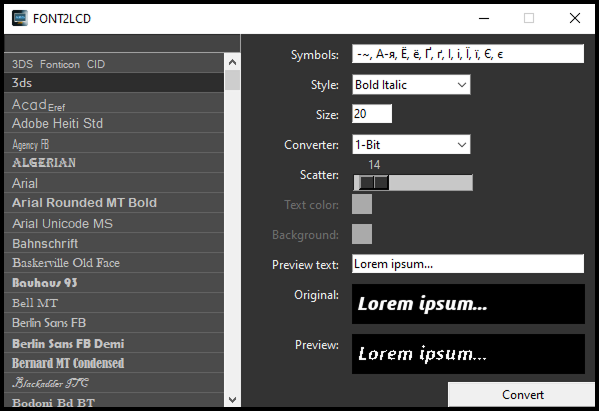

# Font to C Byte Array Converter
A Python application for converting system-installed fonts into C byte arrays.

## Features
- Select a custom character set for conversion
- Change font style
- Adjust font size
- Choose output format
- Modify font contrast

## Supported Output Pixel Formats
- **1-bit (monochrome)**
- **RGB565**

## Usage
**1. Create a virtual environment:** 
`python -m venv env`

**2. Activate the virtual environment:** 
`env\Scripts\activate`

**3. Install dependencies:** 
`pip install -r requirements.txt`

**4. Run the application:** 
`python main.py`

## Font Example
Character set: 1, 2

Generated C array (1-bit monochrome):

<pre>
const char arial_black_20[356] =
	{
		0x00, 0x01, // Type: '1-Bit'
		0x00, 0x07, // Symbols count: '7'

		0x00, 0x31, // Alias: '1'
		0x00, 0x0D, // Symbol width: 13
		0x00, 0x17, // Symbol height: 23
		0x00, 0x26, // Bytes count: 38
		// Data ***************************************************************
		0x00, 0x00, 0x00, 0x00, 0x00, 0x00, 0x00, 0x00, 0x00, 0x00, 0x00, 0x00,
		0x00, 0x03, 0xC0, 0x1E, 0x01, 0xF0, 0x3F, 0x83, 0xFC, 0x1D, 0xE0, 0x8F,
		0x00, 0x78, 0x03, 0xC0, 0x1E, 0x00, 0xF0, 0x07, 0x80, 0x3C, 0x01, 0xE0,
		0x0F, 0x00,
		// ********************************************************************

		0x00, 0x32, // Alias: '2'
		0x00, 0x0D, // Symbol width: 13
		0x00, 0x17, // Symbol height: 23
		0x00, 0x26, // Bytes count: 38
		// Data ***************************************************************
		0x00, 0x00, 0x00, 0x00, 0x00, 0x00, 0x00, 0x00, 0x00, 0x00, 0x00, 0x00,
		0x00, 0x0F, 0xC1, 0xFF, 0x1F, 0xFC, 0xF9, 0xE7, 0x8F, 0x00, 0x78, 0x07,
		0xC0, 0x7C, 0x07, 0xC0, 0x7C, 0x07, 0xC0, 0x7C, 0x07, 0xFF, 0x3F, 0xF9,
		0xFF, 0xC0,
		// ********************************************************************
</pre>

## Notes
- Converter are modular and can be extended with new output formats.
- Useful for embedded displays, OLEDs, LCDs, and microcontroller-based projects.
